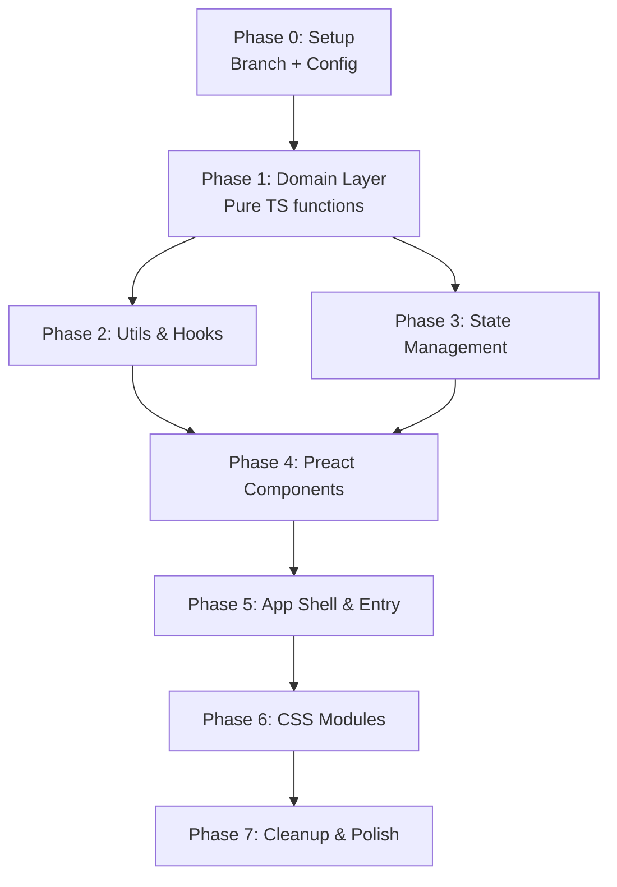

# MC2Sync — Migration Plan: TypeScript + Preact + Functional Architecture

## Goal

Migrate the existing vanilla JavaScript codebase to **TypeScript** with a **functional programming approach**, and replace manual DOM manipulation with **Preact** components. This will run on a new branch `refactor/ts-preact-migration`.

## Current State Summary

| Aspect | Current | Target |
|---|---|---|
| Language | JavaScript (ES modules) | TypeScript (strict mode) |
| UI | Manual DOM + innerHTML strings | Preact (JSX) + Signals |
| Architecture | OOP classes (MC2SyncApp, etc.) | Functional modules + pure functions |
| State | Scattered across class instances | Preact Signals (centralized) |
| Bundler | Vite 5 | Vite 5 (unchanged) |
| 3D Rendering | Three.js | Three.js (unchanged) |
| Styling | Vanilla CSS | CSS Modules |
| Tests | None | Vitest |

---

## Current Bugs & Issues to Fix During Migration

> [!CAUTION]
> These bugs exist in the current codebase and **must** be fixed during the migration.

1. **`buildMergedCard()` is a stub** — The merge function just clones the first card. The headline feature doesn't actually work.
2. **Alpha bit ignored** in `ps2-icon-parser.js` — `(pixel & 0x8000) ? 255 : 255` — both branches return 255.
3. **Duplicate game ID** — `'BASLUS-20665'` maps to two different games; second silently overwrites.
4. **`resize` event listener leak** — `IconRenderer` adds a listener on every instantiation but never removes it.
5. **Circular import** — `ps2mc-writer.js` imports `PS2MemoryCardSync` but never uses it.
6. **No error recovery** — Loader stays in "Loading..." state if parsing throws.
7. **`getSaveEntries()` called repeatedly** without caching — re-parses binary on every call.
8. **Writer FAT offset calculation** doesn't match parser's raw page layout addressing.

---

## Proposed Architecture

### Directory Structure

```
src/
├── app.tsx                    # Preact app root component
├── main.tsx                   # Entry point (render to DOM)
├── index.css                  # Global styles / CSS variables
│
├── domain/                    # Pure domain logic (NO UI, NO side effects)
│   ├── types.ts               # All shared types & interfaces
│   ├── ps2mc-parser.ts        # Memory card binary parser (pure functions)
│   ├── ps2mc-writer.ts        # Memory card binary writer (pure functions)
│   ├── ps2mc-sync.ts          # Sync/compare/merge logic (pure functions)
│   ├── ps2-icon-parser.ts     # 3D icon file parser (pure functions)
│   ├── game-database.ts       # Game ID → title lookup (pure data + functions)
│   └── __tests__/             # Unit tests for domain logic
│       ├── ps2mc-parser.test.ts
│       ├── ps2mc-sync.test.ts
│       └── ps2mc-writer.test.ts
│
├── state/                     # Application state (Preact Signals)
│   └── app-state.ts           # Signals for loaded cards, active card, selection, etc.
│
├── components/                # Preact functional components
│   ├── Header.tsx
│   ├── CardLoader.tsx         # Drag & drop file upload
│   ├── CardsSidebar.tsx       # List of loaded memory cards
│   ├── CardViewer.tsx         # Save entries table for active card
│   ├── SaveRow.tsx            # Individual save row
│   ├── CardInspector.tsx      # Detail panel for selected save
│   ├── IconRenderer.tsx       # Three.js 3D icon (useRef + useEffect)
│   ├── SyncModal.tsx          # Merge preview & execution modal
│   ├── Toast.tsx              # Toast notification system
│   └── ui/                    # Generic reusable UI primitives
│       ├── Badge.tsx
│       ├── Button.tsx
│       ├── Modal.tsx
│       └── ProgressBar.tsx
│
├── hooks/                     # Custom Preact hooks
│   ├── use-file-drop.ts       # Drag & drop file handling
│   ├── use-three-renderer.ts  # Three.js lifecycle management
│   └── use-memory-card.ts     # Card parsing orchestration
│
├── utils/                     # General utilities
│   ├── binary.ts              # ArrayBuffer/DataView helpers
│   ├── format.ts              # Date/size formatters
│   └── download.ts            # Blob download trigger
│
└── assets/
    └── (existing assets)
```

### Key Design Principles

#### 1. Functional Core, Imperative Shell

All domain logic (`domain/`) will be **pure functions** — no classes, no mutations, no side effects. They take input, return output.

```typescript
// ❌ Before: Class with mutable state
class PS2MemoryCard {
  constructor(buffer) {
    this.buffer = buffer;
    this.superblock = parseSuperblock(buffer);
    this.fat = buildFAT(buffer, this.superblock);
    // ...mutates this
  }
  getSaveEntries() { /* reads this.buffer */ }
}

// ✅ After: Pure functions returning immutable data
const parseMemoryCard = (buffer: ArrayBuffer): Result<MemoryCard, ParseError> => {
  const superblock = parseSuperblock(buffer);
  if (!superblock.ok) return superblock;

  const fat = buildFAT(buffer, superblock.value);
  const rootEntries = parseRootDirectory(buffer, superblock.value, fat);
  const saves = extractSaveEntries(buffer, rootEntries, fat);

  return ok({
    superblock: superblock.value,
    fat,
    saves,
    freeSpace: calculateFreeSpace(fat, superblock.value),
    rawBuffer: buffer,
  });
};
```

#### 2. Algebraic Error Handling (Result type)

Instead of try/catch everywhere, domain functions return `Result<T, E>`:

```typescript
// src/domain/types.ts
type Result<T, E> = { ok: true; value: T } | { ok: false; error: E };

const ok = <T>(value: T): Result<T, never> => ({ ok: true, value });
const err = <E>(error: E): Result<E, never> => ({ ok: false, error });
```

#### 3. Preact Signals for State

Replace scattered class-level state with centralized reactive signals:

```typescript
// src/state/app-state.ts
import { signal, computed } from '@preact/signals';

export const loadedCards = signal<MemoryCard[]>([]);
export const activeCardIndex = signal<number | null>(null);
export const selectedSave = signal<SaveEntry | null>(null);

export const activeCard = computed(() =>
  activeCardIndex.value !== null
    ? loadedCards.value[activeCardIndex.value] ?? null
    : null
);

export const hasCards = computed(() => loadedCards.value.length > 0);
```

#### 4. Preact Components (Functional, No Classes)

Every UI component is a pure function component using hooks:

```tsx
// Example: SaveRow.tsx
import { type FunctionComponent } from 'preact';
import { type SaveEntry } from '../domain/types';

interface SaveRowProps {
  save: SaveEntry;
  isSelected: boolean;
  onSelect: (save: SaveEntry) => void;
}

export const SaveRow: FunctionComponent<SaveRowProps> = ({ save, isSelected, onSelect }) => (
  <div
    class={`save-row ${isSelected ? 'selected' : ''}`}
    onClick={() => onSelect(save)}
    role="button"
    tabIndex={0}
    onKeyDown={(e) => e.key === 'Enter' && onSelect(save)}
  >
    {save.iconDataUrl && }
    <div class="save-info">
      <span class="save-title">{save.gameTitle}</span>
      <span class="save-id">{save.directoryName}</span>
    </div>
    <span class="save-size">{formatSize(save.totalSize)}</span>
  </div>
);
```

---

## Proposed Changes — Phase by Phase

### Phase 0: Setup

> Branch creation and tooling configuration.

#### [NEW] Branch `refactor/ts-preact-migration`

Create from current `main`.

#### [MODIFY] package.json

Add TypeScript, Preact, Preact Signals, and Vitest dependencies:

```json
{
  "dependencies": {
    "preact": "^10.25.x",
    "@preact/signals": "^2.x",
    "three": "^0.185.1"
  },
  "devDependencies": {
    "vite": "^5.4.11",
    "typescript": "^5.7.x",
    "@preact/preset-vite": "^2.9.x",
    "@types/three": "^0.185.x",
    "vitest": "^3.x"
  }
}
```

#### [NEW] tsconfig.json

```json
{
  "compilerOptions": {
    "target": "ES2022",
    "module": "ESNext",
    "moduleResolution": "bundler",
    "strict": true,
    "noUncheckedIndexedAccess": true,
    "jsx": "react-jsx",
    "jsxImportSource": "preact",
    "paths": { "@/*": ["./src/*"] }
  },
  "include": ["src"]
}
```

#### [MODIFY] vite.config (new file or update)

Add Preact plugin and path aliases.

#### [DELETE] counter.js

Dead code — Vite scaffold leftover.

#### [DELETE] style.css

Dead code — unused Vite scaffold styles.

#### [DELETE] test-icon.js

Test script in project root — not part of the app.

---

### Phase 1: Domain Layer (`src/domain/`)

> Migrate all pure logic first. Zero UI changes. This is the safest phase — the domain has no DOM dependencies.

#### [NEW] src/domain/types.ts

All shared TypeScript interfaces and types:

```typescript
// Core PS2 structures
interface Superblock { ... }
interface DirectoryEntry { ... }
interface SaveEntry { ... }
interface SaveFile { ... }
interface MemoryCard { ... }
interface Timestamp { ... }

// Sync types
interface ComparisonResult { ... }
interface MergePlan { ... }
interface MergeAction { ... }

// Icon types
interface ParsedIcon { ... }
interface IconVertex { ... }
interface IconShape { ... }

// Utility types
type Result<T, E> = ...
type MergeStrategy = 'newest' | 'largest' | 'manual';
type SaveStatus = 'unique' | 'duplicate' | 'conflict';
```

#### [NEW] src/domain/ps2mc-parser.ts

Migrate from `src/lib/ps2mc-parser.js`:
- Replace `PS2MemoryCard` class with composable pure functions
- Add strong typing for all binary structures
- `parseMemoryCard(buffer) → Result<MemoryCard, ParseError>`
- Cache `saves` in the returned `MemoryCard` object (fixes repeated `getSaveEntries()` calls)
- Extract `readPageData`, `readClusterDataRaw`, `parseTimestamp`, etc. as named exports

#### [NEW] src/domain/ps2mc-writer.ts

Migrate from `src/lib/ps2mc-writer.js`:
- `createBlankCard() → ArrayBuffer`
- **Implement actual `buildMergedCard()`** — fix the stub to properly copy saves, rebuild FAT, and handle ECC/spare bytes consistently with the parser
- Fix FAT offset addressing to match parser's raw page layout

#### [NEW] src/domain/ps2mc-sync.ts

Migrate from `src/lib/ps2mc-sync.js`:
- `compareSaves(cards) → ComparisonResult`
- `generateMergePlan(cards, strategy) → Result<MergePlan, MergeError>`
- `executeMerge(plan) → Result<ArrayBuffer, MergeError>`
- Remove circular import

#### [NEW] src/domain/ps2-icon-parser.ts

Migrate from `src/lib/ps2-icon-parser.js`:
- `parseIcon(buffer) → Result<ParsedIcon, ParseError>`
- **Fix alpha bit**: `const a = (pixel & 0x8000) ? 255 : 0;`
- Strong typing for vertex and texture data

#### [NEW] src/domain/game-database.ts

Migrate from `src/lib/game-database.js`:
- Fix duplicate key `'BASLUS-20665'`
- `lookupGame(dirName) → GameInfo | null`
- `getRegion(dirName) → Region`
- Use `as const` for the database object + `Map` for O(1) lookups

---

### Phase 2: Utilities & Hooks (`src/utils/`, `src/hooks/`)

#### [NEW] src/utils/binary.ts

Extract shared binary helpers: `readUint32`, `readBytes`, `concatBuffers`, etc.

#### [NEW] src/utils/format.ts

Date and file size formatting functions.

#### [NEW] src/utils/download.ts

`downloadBlob(blob, filename)` — trigger browser download.

#### [NEW] src/hooks/use-file-drop.ts

Custom hook encapsulating drag & drop logic (currently in `card-loader.js`):

```typescript
const useFileDrop = (options: FileDropOptions) => {
  const isDragging = useSignal(false);
  // Returns { ref, isDragging } — attach ref to drop zone
};
```

#### [NEW] src/hooks/use-three-renderer.ts

Custom hook managing Three.js lifecycle — scene creation, animation loop, cleanup on unmount. Fixes the resize listener leak.

#### [NEW] src/hooks/use-memory-card.ts

Orchestrates file → parse → store flow:

```typescript
const useMemoryCard = () => {
  const handleFiles = (files: File[]) => { /* parse & add to loadedCards signal */ };
  return { handleFiles, isLoading };
};
```

---

### Phase 3: State Management (`src/state/`)

#### [NEW] src/state/app-state.ts

Centralized Preact Signals:

```typescript
// Core state
export const loadedCards = signal<MemoryCard[]>([]);
export const activeCardIndex = signal<number | null>(null);
export const selectedSave = signal<SaveEntry | null>(null);
export const syncModalOpen = signal(false);

// Derived state
export const activeCard = computed(() => ...);
export const hasCards = computed(() => ...);
export const canSync = computed(() => loadedCards.value.length >= 2);

// Actions (pure functions that update signals)
export const addCard = (card: MemoryCard): void => { ... };
export const removeCard = (index: number): void => { ... };
export const selectCard = (index: number): void => { ... };
export const selectSave = (save: SaveEntry | null): void => { ... };
```

---

### Phase 4: Preact Components (`src/components/`)

> Replace all manual DOM manipulation with declarative Preact components.

#### [NEW] src/components/Header.tsx

Simple static header (extracted from `index.html`).

#### [NEW] src/components/CardLoader.tsx

Replaces `src/components/card-loader.js`:
- Uses `useFileDrop` hook
- File validation logic
- Shows/hides based on `hasCards` signal
- Proper error recovery (fixes loader stuck in "Loading..." state)

#### [NEW] src/components/CardsSidebar.tsx

Replaces the sidebar portion wired in `main.js`:
- Renders list of loaded cards from `loadedCards` signal
- Active card highlighting from `activeCardIndex` signal
- "Load Another" and "Sync Cards" buttons

#### [NEW] src/components/CardViewer.tsx + SaveRow.tsx

Replaces `src/components/card-viewer.js`:
- Table of saves for active card
- Icon rendering moved to a utility (fixes mixed concerns)
- Keyboard accessible rows

#### [NEW] src/components/CardInspector.tsx

Replaces `src/components/card-inspector.js`:
- Reads from `selectedSave` signal
- Mounts `IconRenderer` component for 3D icon
- Remove `setTimeout` hack — Preact handles DOM timing

#### [NEW] src/components/IconRenderer.tsx

Replaces `src/components/icon-renderer.js`:
- Uses `useThreeRenderer` hook
- Proper cleanup on unmount (fixes resize listener leak)
- Receives parsed icon data as props

#### [NEW] src/components/SyncModal.tsx

Replaces `src/components/sync-panel.js`:
- Uses `Modal` UI primitive
- Reads cards from signal
- Remove `setTimeout` hack — use proper async flow

#### [NEW] src/components/Toast.tsx

Replaces `src/components/toast.js`:
- Signal-driven toast queue
- Auto-dismiss with CSS animations

#### [NEW] src/components/ui/ (Badge, Button, Modal, ProgressBar)

Reusable UI primitives extracted from repeated patterns.

---

### Phase 5: App Shell & Entry Point

#### [NEW] src/app.tsx

Root Preact component composing all sections:

```tsx
export const App = () => (
  <>
    <Header />
    <main class="app-main">
      {!hasCards.value ? (
        <CardLoader />
      ) : (
        <>
          <CardsSidebar />
          <CardViewer />
          {selectedSave.value && <CardInspector />}
        </>
      )}
    </main>
    <SyncModal />
    <ToastContainer />
  </>
);
```

#### [NEW] src/main.tsx

Entry point — renders `<App />` into `#app`.

#### [MODIFY] index.html

Strip all static DOM content. Keep only:

```html
<body>
  <div id="app"></div>
  <script type="module" src="/src/main.tsx"></script>
</body>
```

---

### Phase 6: Styles

#### CSS Modules

Convert `src/styles/main.css` into component-scoped CSS modules:
- `src/components/CardLoader.module.css`
- `src/components/CardViewer.module.css`
- etc.
- Keep `src/index.css` for CSS variables, resets, and global tokens

This eliminates all inline `style="..."` attributes from current components.

---

### Phase 7: Cleanup & Polish

- Remove all old `.js` files from `src/components/` and `src/lib/`
- Remove dead files (`counter.js`, `style.css`, `test-icon.js`, `test.obj`)
- Add proper ARIA attributes and keyboard navigation
- Verify all features work end-to-end

---

## Verification Plan

### Automated Tests

```bash
npx vitest run
```

Domain layer tests:
- `ps2mc-parser.test.ts` — Parse a known `.ps2` file, verify superblock values, FAT structure, save entries
- `ps2mc-sync.test.ts` — Compare cards with known saves, verify conflict detection and merge plan generation
- `ps2mc-writer.test.ts` — Create blank card, verify magic bytes, superblock structure, and FAT validity

### Manual Verification

1. Drop a `.ps2` file → verify saves are listed with correct titles, icons, and metadata
2. Select a save → verify inspector shows details and 3D icon renders and animates
3. Load multiple cards → verify sidebar updates, switching between cards works
4. Click "Sync Cards" → verify comparison is correct (duplicates, conflicts, uniques identified)
5. Click "Merge & Download" → verify downloaded file is a valid `.ps2` with merged saves
6. Test drag & drop, button browse, and invalid file rejection
7. Test responsiveness at various viewport sizes

---

## Execution Order & Dependencies



> [!IMPORTANT]
> Phase 1 (Domain) has **zero UI dependencies** and can be tested in isolation. This is intentionally first so we have a solid, typed foundation before touching any UI code.

---

## Open Questions

> [!WARNING]
> **1. `buildMergedCard()` implementation** — The current merge function is a stub. Should I implement a full working version that properly copies saves between cards, rebuilds the FAT, and writes correct ECC data? This is significant work but is the app's core feature.

> [!IMPORTANT]
> **2. Three.js retention** — Three.js adds ~600KB to the bundle. It's only used for the 3D icon preview. Options:
> - Keep Three.js (current approach)
> - Replace with a lightweight WebGL wrapper (smaller bundle, more work)
> - Make it a lazy-loaded chunk (compromise — keep Three.js but don't load until needed)

> [!NOTE]
> **3. Test data** — Do you have sample `.ps2` memory card files we can use for automated tests? Without real test files, domain tests would need synthetic/mocked binary data.

> [!NOTE]
> **4. CSS approach** — The plan proposes CSS Modules for component-scoped styles. Would you prefer to keep a single global CSS file instead, or are you open to CSS Modules?
